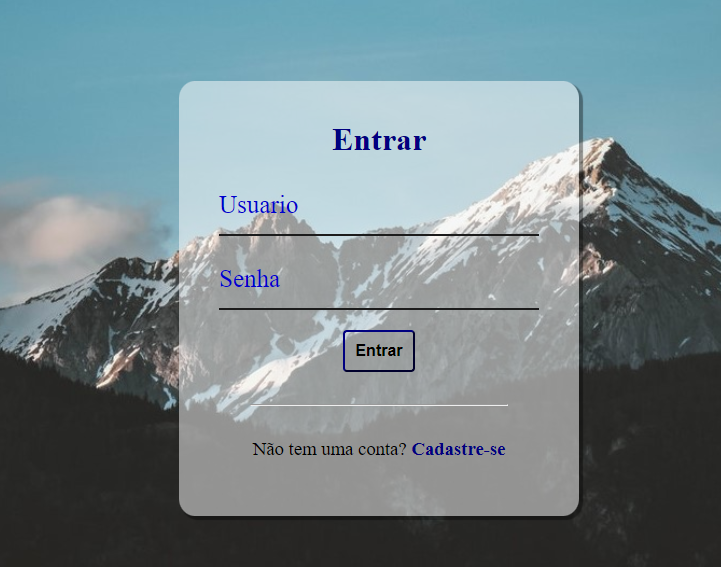

# Tela de login

> tela de login.

## 🤝 desenvolvido por

<table>
  <tr>
    <td align="center">
      <a href="#">
         
        
          <b>Henrique leandro</b>
        
      </a>
    </td>
  </tr>
</table>

